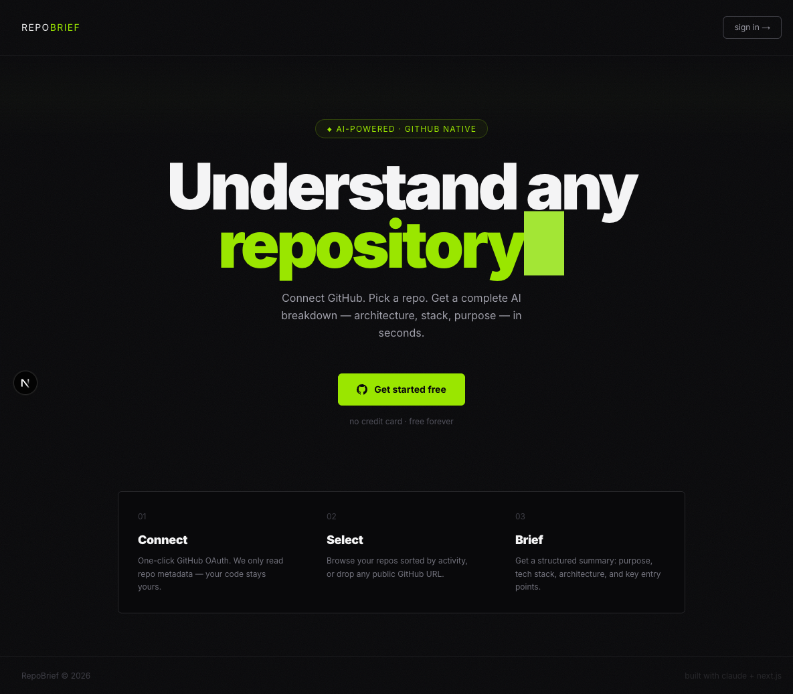
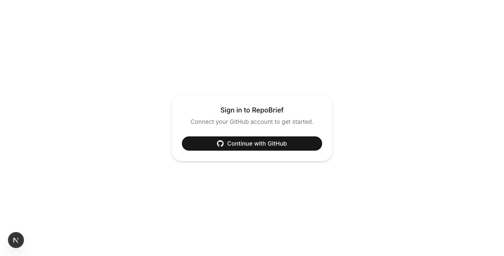

# RepoBrief

> Understand any GitHub repository in seconds — powered by Claude AI.



**RepoBrief** analyzes GitHub repositories and generates a structured breakdown: description, architecture diagram, file map, onboarding guide, and tech stack badges — streamed live as Claude thinks. Results are cached and shareable with a permanent link.

🌐 **Live:** [repobrief.vercel.app](https://repobrief.vercel.app)

---

## Features

- **GitHub OAuth** — one-click sign-in, no manual token setup
- **AI Analysis** — Claude reads your repo's key files and generates a structured summary
- **Live Streaming** — see the response stream token-by-token as it's generated
- **Commit-hash Cache** — same commit SHA = instant result from Postgres, no Claude call
- **Shareable Links** — every analysis gets a public `/analysis/owner/repo` URL with view count
- **Mermaid Architecture Diagram** — auto-rendered from Claude's output
- **Tech Stack Badges** — color-coded by category (language, framework, database, devops…)
- **Export as Markdown** — download the full analysis as a `.md` file
- **Monthly Quota** — free plan: 5 analyses/month with dashboard progress bar
- **Rate Limiting** — 429 with clear upgrade message when limit is reached



---

## How It Works

1. Sign in with GitHub OAuth
2. Pick any repo from your list
3. Click **Analyze with Claude**
4. Watch the analysis stream in real-time (or get instant result from cache)
5. Get: description · architecture diagram · file map · onboarding guide · tech stack
6. Share the permanent link or export as Markdown

**Context management:** RepoBrief scores and selects the top ~15 files (README, entry points, config, schema, routes) to fit within Claude's context window without sending everything.

**Cache strategy:** Before calling Claude, the latest commit SHA is fetched. If an analysis for that exact SHA exists in Postgres and is less than 7 days old, it's served instantly. New commit = cache miss = fresh analysis.

---

## Tech Stack

| Layer | Technology |
|---|---|
| Framework | Next.js 16.2 (App Router) |
| Language | TypeScript + React 19 |
| AI | Anthropic Claude (claude-sonnet-4-6) |
| Auth | NextAuth v5 + GitHub OAuth |
| GitHub API | Octokit v5 |
| Database | Neon Postgres + Prisma 6 |
| UI | shadcn/ui + Tailwind CSS v4 |
| Diagrams | Mermaid.js + DOMPurify |
| Deploy | Vercel |

---

## Local Development

```bash
# Clone
git clone https://github.com/DoganayBalaban/repobrief.git
cd repobrief

# Install dependencies
npm install

# Set up environment variables
cp .env.example .env.local
# Fill in all required variables (see below)

# Run database migrations
npx prisma migrate dev

# Run dev server
npm run dev
```

Open [http://localhost:3000](http://localhost:3000).

### Environment Variables

| Variable | Description |
|---|---|
| `AUTH_SECRET` | NextAuth secret — generate with `openssl rand -base64 32` |
| `AUTH_GITHUB_ID` | GitHub OAuth App Client ID |
| `AUTH_GITHUB_SECRET` | GitHub OAuth App Client Secret |
| `ANTHROPIC_API_KEY` | Anthropic API key |
| `DATABASE_URL` | Neon Postgres connection string |

### GitHub OAuth Setup

1. Go to GitHub → Settings → Developer settings → OAuth Apps → New OAuth App
2. Set **Authorization callback URL** to `http://localhost:3000/api/auth/callback/github`
3. Copy Client ID and Secret to `.env.local`

### Database Setup (Neon)

1. Create a free project at [neon.tech](https://neon.tech)
2. Copy the connection string to `DATABASE_URL` in `.env.local`
3. Run `npx prisma migrate dev` to create tables

---

## Project Structure

```
src/
├── app/
│   ├── api/
│   │   ├── analyze/        # POST: streaming Claude analysis + DB cache
│   │   └── usage/          # GET: monthly quota info for current user
│   ├── analysis/[owner]/[repo]/  # Public shareable analysis page
│   ├── auth/               # Sign-in page
│   ├── dashboard/          # Repo list with quota widget
│   │   └── [owner]/[repo]/ # Repo detail + AnalyzeButton
│   └── page.tsx            # Landing page
├── components/
│   ├── analyze-button.tsx  # Streaming UI, cache badge, result cards
│   └── mermaid-diagram.tsx # Mermaid renderer with DOMPurify
└── lib/
    ├── analyze-stream.ts   # Claude messages.stream() → ReadableStream
    ├── db.ts               # Prisma singleton
    ├── file-content.ts     # Fetch + truncate key files
    ├── file-score.ts       # File importance scoring
    ├── file-tree.ts        # GitHub git tree fetcher (max 150 files)
    ├── octokit.ts          # Authenticated Octokit from session
    ├── parse-xml.ts        # XML section parser (client-safe)
    └── prompt.ts           # System + user prompt builder
prisma/
└── schema.prisma           # Analysis model (owner, repo, commitSha, result, userId)
```

---

## API

### `POST /api/analyze`
Streams a Claude analysis. Checks Postgres cache first (commit SHA + 7-day TTL).

**Headers returned:**
- `X-Cache: HIT | MISS`
- `X-Commit-SHA: <short-sha>`
- `X-Cache-Age: <seconds>` (on HIT)
- `X-RateLimit-Remaining: <n>` (on 429)

**Rate limit:** Free plan — 5 analyses per calendar month per user. Returns `429` with upgrade message when exceeded. Cache HITs don't count toward the quota.

### `GET /api/usage`
Returns current user's monthly quota.

```json
{ "used": 2, "limit": 5, "remaining": 3, "resetsAt": "2026-05-01T00:00:00.000Z" }
```

---

## Roadmap

- [x] GitHub OAuth
- [x] Octokit file pipeline
- [x] Claude API streaming
- [x] Mermaid architecture diagram
- [x] Tech stack badges + export + share
- [x] Neon Postgres — shareable analysis pages with view count
- [x] Commit SHA-based cache (7-day TTL, instant HIT response)
- [x] Free plan rate limiting (5/month) + quota dashboard widget
- [ ] Private repo support (Pro plan)
- [ ] Stripe billing integration
- [ ] API access (Pro plan)

---

Built with [Claude](https://claude.ai) · [Next.js](https://nextjs.org) · [Neon](https://neon.tech) · [Vercel](https://vercel.com)
